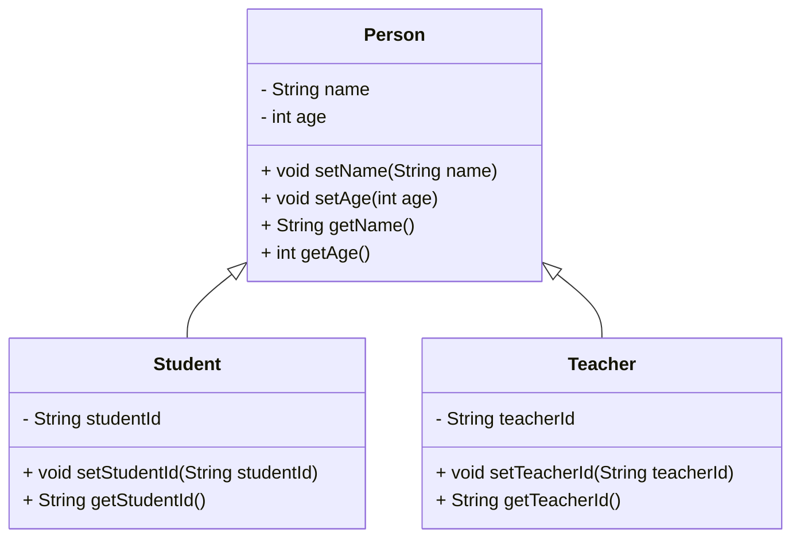

# Diagram

```mermaid
classDiagram
    class Person {
        - String name
        - int age
        + void setName(String name)
        + void setAge(int age)
        + String getName()
        + int getAge()
    }
    Person <|-- Student
    Person <|-- Teacher
    class Student {
        - String studentId
        + void setStudentId(String studentId)
        + String getStudentId()
    }
    class Teacher {
        - String teacherId
        + void setTeacherId(String teacherId)
        + String getTeacherId()
    }
```