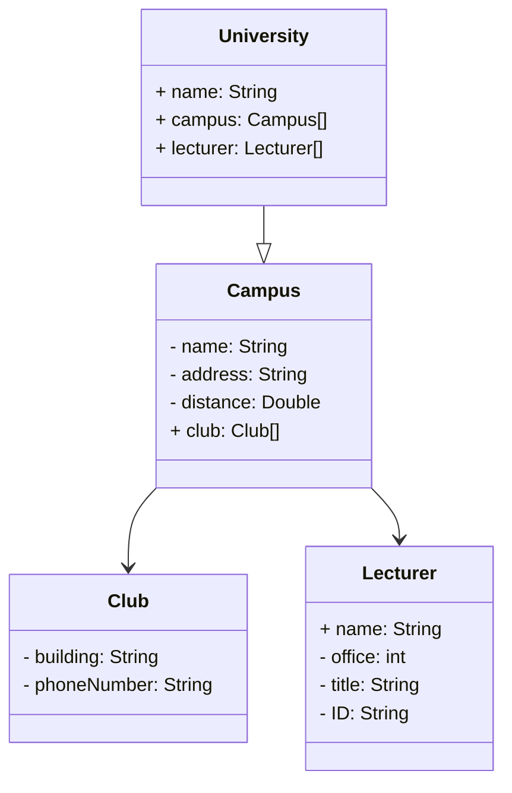

# Diagram

> _**StudentID**: 10422021_  
> _**Name**: Tran Hai Duong_

```mermaid
classDiagram
    class University{
        + name: String
        + campus: Campus[]
        + lecturer: Lecturer[]
    }

    class Campus{
        - name: String
        - address: String
        - distance: Double
        + club: Club[]
    }

    class Club{
        - building: String
        - phoneNumber: String
    }

    class Lecturer{
        + name: String
        - office: int
        - title: String
        - ID: String
    }

    University --|> Campus
    Campus --> Club
    Campus --> Lecturer
```